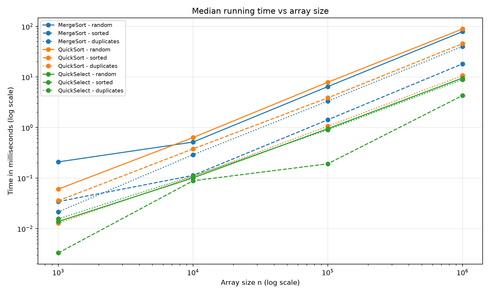
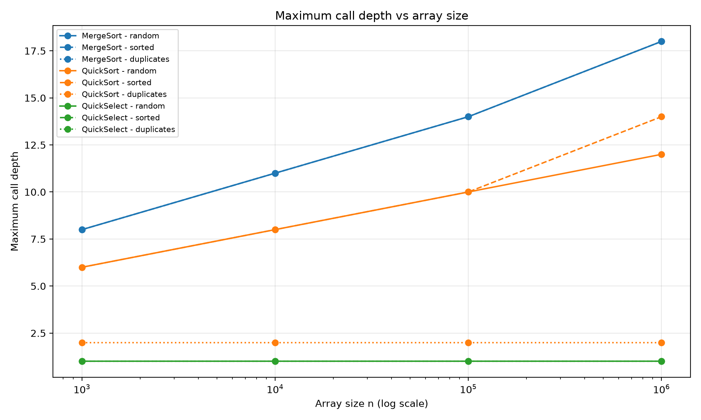
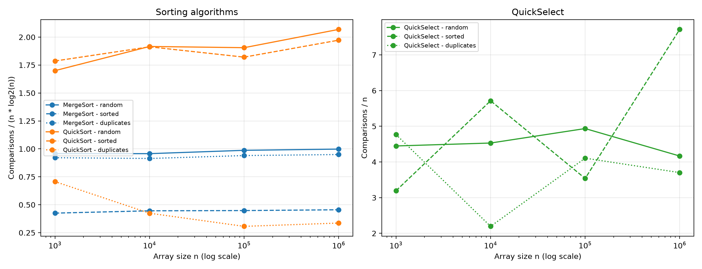

# Assignment 1: Divide and Conquer

## 1. Implementation

This project implements MergeSort, QuickSort and QuickSelect for integer
arrays in Java. Maven builds the project, and JUnit 5 runs the tests.

MergeSort creates one helper array in the public sort method. Recursive
calls reuse this array. Subarrays with 15 or fewer elements are sorted
using Insertion Sort. The merge method combines two sorted halves in
linear time.

QuickSort chooses a random pivot and uses three-way partitioning:
values smaller than the pivot, equal values, and greater values.
It recursively sorts only the smaller part. The larger part is processed
with a while loop. This bounds the recursive stack depth by O(log n),
even when partitions are unbalanced.

QuickSelect reuses QuickSort.partition. It continues only in the part
containing index k. The index starts from zero. Invalid indices and
empty or null arrays cause IllegalArgumentException.
The implementation uses a loop instead of recursive calls.

Metrics stores element comparisons, maximum call depth and elapsed
nanoseconds. Index checks and loop conditions are not counted as element
comparisons. In the partition method, the less-than check counts once;
the greater-than check counts again when it is evaluated.

Depth counts simultaneously active sorting or selection calls, starting
at 1 for a non-empty input. Helper methods are excluded. QuickSelect
therefore has depth 1. Empty sorting inputs have depth 0.

## 2. Asymptotic bounds

The table describes running time for arrays of size n.
Randomized average bounds mean expected time over random pivot choices.
For the general average case, keys are assumed to be distinct.

| Algorithm | Best case | Average case | Worst case |
|---|---|---|---|
| MergeSort | Θ(n log n): sorted input still goes through all merge levels | Θ(n log n): balanced splitting and linear merging on each level | Θ(n log n): even heavily interleaved halves need only linear merging |
| QuickSort | Θ(n): all values equal, so one partition finishes the work | Θ(n log n): random pivots on distinct keys give logarithmic expected partition depth | Θ(n²): repeatedly choosing an extreme value on distinct keys gives highly uneven splits |
| QuickSelect | Θ(n): the first pivot's equal region contains k | Θ(n): random pivots reduce the remaining search region sufficiently in expectation | Θ(n²): extreme pivots repeatedly discard only one element while k stays in the large part |
| Insertion Sort | Θ(n): already sorted input needs one failed shift comparison per new element | Θ(n²): random distinct values require many shifts | Θ(n²): reverse order makes each new value move across the sorted prefix |

For QuickSort with distinct keys, the best balanced case is Θ(n log n).
The Θ(n) best case in the table is possible because this implementation
supports duplicates with three-way partitioning.

Random pivots do not eliminate QuickSort's quadratic worst case.
They prevent sorted input from systematically causing that case.

The Insertion Sort cutoff is a fixed constant, so it does not change
MergeSort's asymptotic Θ(n log n) bound.

## 3. Recurrences and the Master Theorem

The standard form is:

T(n) = a T(n/b) + f(n)

Here, a is the number of recursive subproblems, n/b is their size,
and f(n) is the work outside those subproblems.

### MergeSort

T(n) = 2 T(n/2) + Θ(n)

- a = 2
- b = 2
- f(n) = Θ(n)
- n^(log_b(a)) = n
- Master Theorem case 2
- Result: Θ(n log n)

There are two recursive halves. Copying and merging their elements
takes linear time. Sizes at or below 15 are constant-size base cases.

### QuickSort: balanced split

T(n) = 2 T(n/2) + Θ(n)

- a = 2
- b = 2
- f(n) = Θ(n)
- n^(log_b(a)) = n
- Master Theorem case 2
- Result: Θ(n log n)

This recurrence assumes distinct keys and balanced splits.
A random pivot is not always near the middle, but each rank is equally
likely. Averaging over pivot ranks gives expected O(n log n) time;
for distinct keys the expected bound is tight, Θ(n log n).

The while loop changes stack usage, but both outer partitions still
need sorting. Therefore, it does not remove work from this recurrence.

Worst-case uneven splits instead give:

T(n) = T(n - 1) + Θ(n) = Θ(n²)

The standard Master Theorem does not apply to this recurrence.

### QuickSelect: balanced split

T(n) = T(n/2) + Θ(n)

- a = 1
- b = 2
- f(n) = Θ(n)
- n^(log_b(a)) = 1
- Master Theorem case 3
- Regularity condition: a f(n/b) is approximately f(n)/2
- Result: Θ(n)

Only one side is processed after partitioning.
The work forms a decreasing sum: n + n/2 + n/4 + ... = Θ(n).
This recurrence describes the remaining work even though the code
uses iteration.

Worst-case progress of one element per partition gives Θ(n²).
The general expected bound with random pivots is Θ(n).

## 4. Benchmark method

The benchmark uses sizes 1,000, 10,000, 100,000 and 1,000,000.

Input types are:
- random: random Java integers;
- sorted: integers from 0 to n - 1;
- duplicates: random integers from 0 to 9.

Input generation uses seed 42 + n. Each algorithm receives a fresh
copy of the same input for each run. Pivot choices are not seeded,
so QuickSort and QuickSelect measurements can vary between executions.

Before measurements, each algorithm runs five warm-up executions
on 10,000 elements for each input type. Every measured case then
runs five times. The five Metrics objects are ordered by elapsed time.
The middle object's time, comparisons and depth are written to the CSV.
Thus comparisons and depth belong to the median-time run; they are
not independent medians.

QuickSelect searches for k = n / 2. Input generation, cloning and
correctness checking are outside the algorithm timer.
Algorithm-internal allocations are included.

Sort results are checked against Arrays.sort. Selection results are
checked against the corresponding element of a sorted copy.

The recorded environment is Windows 11, Temurin OpenJDK 25.0.2
and Maven 3.9.16. The project targets Java 17.

## 5. Results and plots

### Running time

Both time axes use logarithmic scales.

At n = 1,000,000:

| Input | MergeSort, ms | QuickSort, ms | QuickSelect, ms |
|---|---:|---:|---:|
| random | 78.7672 | 88.9079 | 9.5122 |
| sorted | 18.1727 | 45.6209 | 4.2883 |
| duplicates | 40.1723 | 10.6563 | 8.8842 |

QuickSelect solves a smaller task than full sorting, so these times
should be interpreted with that difference in mind.

### Maximum call depth

MergeSort's measured depth grows from 8 to 18.
QuickSort's random-input depth grows from 6 to 12.
Its sorted-input depth reaches 14 at one million elements.

For the measured sorted array of 100,000 elements, QuickSort depth is
10, below 2 log2(100,000), which is approximately 33.22.

QuickSelect stays at depth 1 because it uses iteration.
QuickSort on duplicate-heavy inputs stays at depth 2 in these runs.
These are stack-depth measurements, not total partition counts.

### Normalized comparison counts

For the sorts, the plotted ratio is comparisons / (n log2(n)).
For QuickSelect, it is comparisons / n.

MergeSort on random input has ratios approximately
0.958, 0.957, 0.987 and 0.998. This is consistent with Θ(n log n).

QuickSort on random input has ratios approximately
1.700, 1.916, 1.905 and 2.069. The values are reasonably stable,
with variation from random pivot choices.

QuickSelect on random input has ratios
4.448, 4.530, 4.935 and 4.166. This supports expected linear growth.
The sorted-input ratios fluctuate more, reaching 7.714 at one million
elements. Five runs do not remove all pivot-related variation.

### Empirical Θ check

Let C(n) be the recorded comparison count.
The following constants satisfy c1*g(n) <= C(n) <= c2*g(n)
at all sampled sizes from n0 = 10,000 onward.

| Algorithm and input | g(n) | c1 | c2 |
|---|---|---:|---:|
| MergeSort, random | n log2(n) | 0.94 | 1.02 |
| MergeSort, sorted | n log2(n) | 0.43 | 0.47 |
| MergeSort, duplicates | n log2(n) | 0.90 | 0.97 |
| QuickSort, random | n log2(n) | 1.85 | 2.15 |
| QuickSort, sorted | n log2(n) | 1.75 | 2.05 |
| QuickSelect, random | n | 4.00 | 5.10 |
| QuickSelect, sorted | n | 3.30 | 8.00 |
| QuickSelect, duplicates | n | 2.00 | 4.30 |
| QuickSort, duplicates | n | 4.90 | 6.90 |

QuickSort's duplicate-input comparison count is better described by
Θ(n) for this fixed set of ten possible values. Each partition removes
one distinct value, so an element passes through at most ten partition
levels. Its comparisons / n values at the last three sizes are
approximately 5.636, 5.093 and 6.701.

Consequently, its required comparisons / (n log2(n)) plot should not
be treated as evidence of a tight Θ(n log n) bound on these inputs.
For a fixed number of distinct values, that ratio tends toward zero,
although individual measurements can fluctuate.

These constants summarize a finite experiment. They do not prove
the inequalities for every n >= n0. The asymptotic arguments provide
the theoretical bounds; measurements provide supporting evidence.

## 6. Discussion

The measurements generally agree with the expected growth rates.
MergeSort shows stable comparison ratios, while its sorted-input time
is lower because the cutoff and merge comparisons need less work.
QuickSort is especially fast on duplicate-heavy arrays because equal
values are removed from further partitioning together.
Random pivots cause variation in comparisons and execution time.
QuickSelect's constant stack depth comes from iteration and does not
mean constant running time.
JVM warm-up and compilation can affect short runs even after warm-up.
Garbage collection and CPU cache behavior can also affect time, although
these effects were not measured separately.
The cutoff reduces recursive-call overhead for small MergeSort parts.
More repetitions and sizes would make the experimental conclusions
more reliable.

## 7. Tests

The supplied JUnit suite contains 16 test methods covering:
- MergeSort and QuickSort against Arrays.sort on 100 random arrays each;
- empty, single-element, equal and sorted sorting inputs;
- reverse order and duplicate-heavy inputs;
- MergeSort cutoff boundaries;
- QuickSort's depth bound on 100,000 sorted elements;
- QuickSelect against sorted[k] on 100 random arrays;
- first, last and duplicate-containing selection positions;
- invalid selection input and metric reset behavior.

Run the suite with: mvn clean test